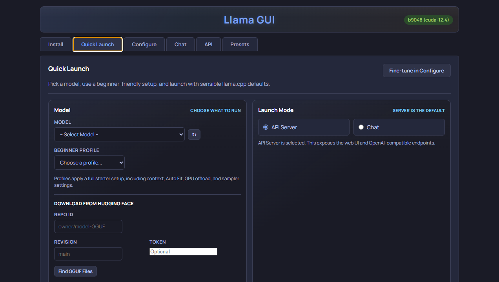
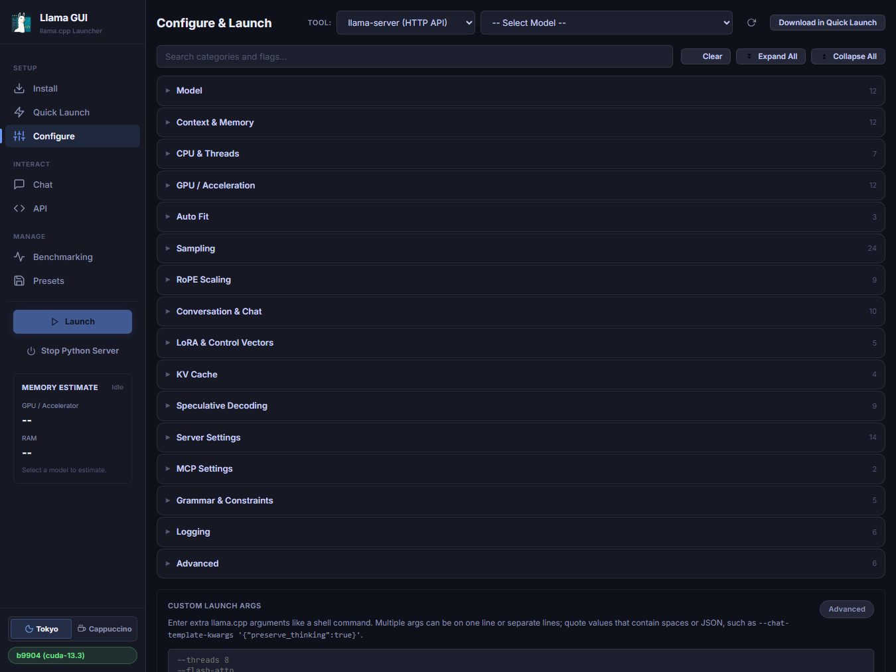
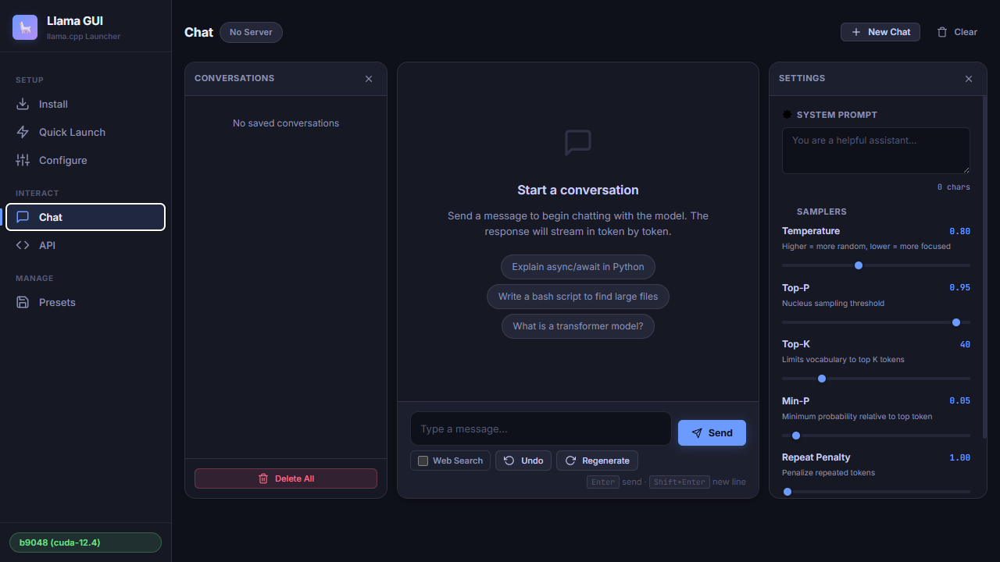
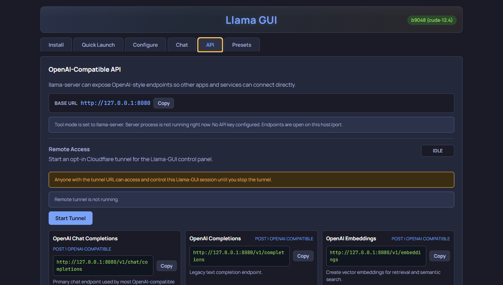
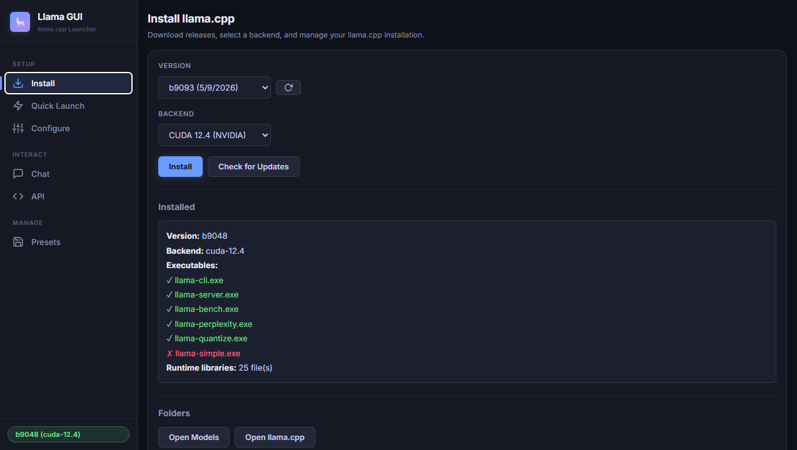
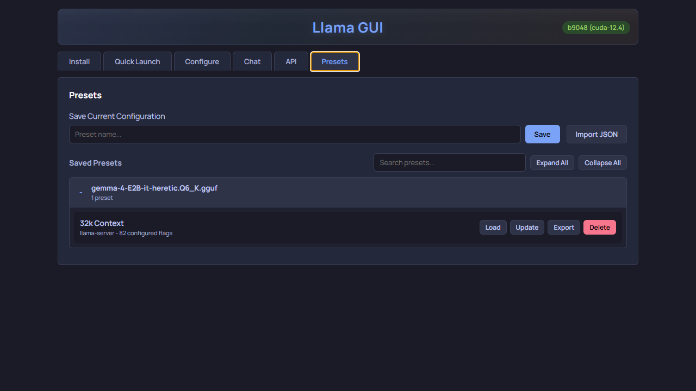

# Llama GUI

<p align="left">
  
</p>

Lightweight local launcher and control panel for `llama.cpp` on Windows, macOS, and Linux.

Llama GUI provides a browser UI to:
- install prebuilt `llama.cpp` releases by backend (CPU/CUDA/Vulkan/SYCL/HIP; Lemonade ROCm on supported AMD targets)
- launch `llama-server` or `llama-cli` from beginner **Quick Launch** or full **Configure**
- chat with streaming Markdown, Focus mode, collapsed reasoning, and optional zero-key web search
- benchmark with `llama-bench` / `llama-perplexity`, monitor live stats, and use OpenAI-compatible API snippets
- manage launch presets, keep two server presets on configuration standby for quick switching, create Windows preset shortcuts, and run in-app GitHub updates

Special thanks to ggml-org for [llama.cpp](https://github.com/ggml-org/llama.cpp).

## Contents

- [Requirements](#requirements)
- [Quick Start](#quick-start)
- [Install With Pinokio](#install-with-pinokio)
- [Screenshots](#screenshots)
- [Getting Models](#getting-models)
- [First Run](#first-run)
- [Advanced Access](#advanced-access)
- [What Each Tab Does](#what-each-tab-does)
- [Presets and Samplers](#presets-and-samplers)
- [Maintenance](#maintenance)
- [Data Locations](#data-locations)
- [Troubleshooting](#troubleshooting)
- [Security Notes](#security-notes)
- [Running Tests](#running-tests)

## Requirements

- Python 3.9+, `pip`, and virtual environment support (`python -m venv`)
- Internet access for release downloads, optional app updates, and optional Chat web search
- A supported OS/architecture for the prebuilt `llama.cpp` binaries you want

Supported prebuilt backends (installer only offers matches for your OS/arch):
- Windows: CPU, CUDA, Vulkan, SYCL, HIP
- macOS: Apple Silicon (`Metal`, optional `KleidiAI`) and Intel CPU
- Linux: CPU, Vulkan, ROCm, OpenVINO (depends on architecture; some accelerators need vendor drivers)

## Quick Start

### One-command install

macOS/Linux:

```bash
curl -fsSL https://raw.githubusercontent.com/thomas9120/LLama-GUI/main/online_installers/install-online.sh | sh
```

Windows PowerShell:

```powershell
irm https://raw.githubusercontent.com/thomas9120/LLama-GUI/main/online_installers/install-online.ps1 | iex
```

The online installer clones into `~/LLama-GUI` (macOS/Linux) or `%USERPROFILE%\LLama-GUI` (Windows), installs dependencies, and starts the app. Set `LLAMA_GUI_INSTALL_DIR` for a custom path, or `LLAMA_GUI_NO_START=1` to install without starting. On Windows it also creates a **Llama GUI** desktop shortcut.

### Manual install

```bash
git clone https://github.com/thomas9120/LLama-GUI.git
cd LLama-GUI
```

Install dependencies:
- macOS/Linux: `./install.sh`
- Windows: `windows_install.bat`

If macOS/Linux reports `permission denied`, restore the executable bit:

```bash
chmod +x install.sh mac_linux_start.sh mac_linux_silent_start.sh
```

Start the app:
- Windows: desktop shortcut, `windows_start.bat`, or `windows_startsilent.bat`
- macOS/Linux: `./mac_linux_start.sh` or `./mac_linux_silent_start.sh`

Open `http://127.0.0.1:5240`. In **Install**, choose a version + backend and click **Install**. Add models (see [Getting Models](#getting-models)), launch from **Quick Launch**, then use **Chat** or **Configure** as needed.

To recreate the Windows desktop shortcut without reinstalling:

```powershell
powershell -NoProfile -ExecutionPolicy Bypass -File .\scripts\create_windows_shortcuts.ps1 -ShortcutsOnly
```

To build CUDA `llama.cpp` yourself on Linux, see `Linux_compile_toolkit/`.

## Install With Pinokio

If you use [Pinokio](https://pinokio.computer/), install via [thomas9120/llama-gui-pinokio](https://github.com/thomas9120/llama-gui-pinokio). The Pinokio launcher starts Llama GUI; the in-app **Install** tab still manages `llama.cpp` backends, models, presets, and launches.

## Screenshots

| Quick Launch | Configure |
| --- | --- |
|  |  |

| Chat | API |
| --- | --- |
|  |  |

| Install | Presets |
| --- | --- |
|  |  |

## Getting Models

Place `llama.cpp`-compatible `.gguf` files in `models/` (or use **Open Models**). They appear in **Quick Launch** and **Configure**.

Or download in-app from **Quick Launch**:
1. Enter a Hugging Face repo ID such as `owner/model-GGUF`.
2. Click **Find GGUF Files**, pick a file, then **Download**.

For vision/multimodal models, also download the matching `mmproj` file when the repo provides one. Projector files land in `models/mmproj/` and the Multimodal Projector setting is applied automatically.

## First Run

1. Install a backend in **Install** and confirm the badge shows an installed version (not `Not Installed`).
2. Add at least one `.gguf` to `models/`.
3. In **Quick Launch**: keep `API Server`, choose a model, keep defaults or pick a profile, click **Launch**.
4. Confirm: header shows `Running`, output has startup logs, stats bar appears (if metrics enabled).
5. Optional: **Chat** (enable **Web Search** for current-events questions), **API** snippets for `/v1/chat/completions`, or **Configure** for full flags.

If first run fails, use **Install → Repair Install** and relaunch.

## Advanced Access

By default Llama GUI listens only on `127.0.0.1:5240`. On a trusted LAN or VPN:

```bash
LLAMA_GUI_HOST=0.0.0.0 LLAMA_GUI_PORT=5240 python server.py
```

Open `http://<server-ip>:5240`. `LLAMA_GUI_PORT` defaults to `5240`. Start scripts honor these variables; if the host is a wildcard (`0.0.0.0`, `::`, `*`), the browser still opens at `127.0.0.1:<port>`.

Hostname / mDNS / reverse-proxy access also needs an explicit allowlist:

```bash
LLAMA_GUI_HOST=0.0.0.0 LLAMA_GUI_ALLOWED_HOSTS=llama-box.local python server.py
```

Do not expose this admin UI to the public internet — there is no built-in auth. Use a trusted network, VPN, or authenticated reverse proxy.

For external supervisors that should own restarts after an in-app update:

```bash
LLAMA_GUI_SUPERVISED=1 python server.py
```

Restart requests clean up and exit with status `75` (supervisor should restart only for that status). Ordinary shutdowns exit `0`. Without supervised mode, Llama GUI restarts itself.

## What Each Tab Does

### Install

Install/update/repair `llama.cpp`, open **Models** / **llama.cpp** folders, **Remove llama.cpp Files**, and app updates (**Check App Updates** / **Update App from GitHub**).

If the updater says local changes are blocking the update, Windows users can close the app, run `stash-updates.bat` from the Llama GUI folder (`git stash -u`), then restart and retry.

### Quick Launch

Beginner launcher: model, mode (`API Server` or `Chat`), context, GPU offload, Auto Fit, templates, samplers. Shares state with **Configure**. Shows server address and command preview before launch.

The **Model Switcher** card can assign exactly two saved full `llama-server` presets. “Standby” means the configuration is saved and ready to preflight; it does not keep a second model in RAM or VRAM. Switching validates the executable and model source, stops the single active process, then waits for the replacement server to report ready. This is a hard cutover rather than llama-swap-style routing, so external API calls may briefly fail while the new model loads.

### Configure

Full flag browser (search, expand/collapse, beginner tips), command preview, **Custom Launch Args** (shell-like quoting; duplicates of UI flags warn; unparseable input blocks launch), server URL preview, and live stats bar for `llama-server`.

Defaults: tool `llama-server`, `-fit on`, context `16000`. Stats require `--metrics` (on by default); toggled from Quick Launch (“Show server stats bar”) or Configure (“Prometheus Metrics”) — both stay in sync.

**MCP Settings**: `--ui-mcp-proxy` and `--tools` (high-risk tools are marked and warned).

### Benchmarking

Throughput (`llama-bench`) and perplexity (`llama-perplexity`) from Current Configure, a Saved Preset, or Manual Model. WikiText-2 helper available. Uses the same process slot as normal launches — stop any running server first. Results last for the page session only.

### API

OpenAI-compatible endpoint overview and copy-ready snippets (cURL, Python, JavaScript). Opt-in **Remote Access** starts a Cloudflare tunnel for the Llama GUI control panel only after **Start Tunnel**.

### Chat

Talks to running `llama-server` via `/v1/chat/completions` with streaming Markdown, Focus mode, history/settings panels, system prompt, shared sampler controls, undo/regenerate/clear, code copy buttons, and collapsed reasoning when the server streams it.

**Web Search** (optional): no API key. The local server searches (free `ddgs`), fetches public pages, injects graded source context, and shows source chips under answers. History is not polluted with raw search text. Leave off for fully local chat. See [Security Notes](#security-notes) for fetch limits.

### Presets

Save/load full launcher presets as JSON in `presets/`, or import existing preset JSON. Windows can export preset shortcuts that open Llama GUI with a saved preset loaded.

## Presets and Samplers

Sampler presets appear in **Quick Launch** and Configure **Sampling**:
- built-ins: `Neutral`, `Balanced`, `Creative`, `Precise`
- custom Save / Load / Delete, JSON Import / Export
- custom presets live in browser `localStorage`; import accepts single- or multi-preset JSON

Quick Launch, Configure, and Chat samplers share one state. Loading a full app preset can overwrite sampler values (samplers are part of the flag set).

## Maintenance

**Remove llama.cpp Files** clears runtime files under `llama/` (`bin`, `grammars`) and resets install metadata in `config.json`. It does **not** remove `models/`, `presets/`, or `llama/custom/`.

### Custom pre-compiled binaries

1. Put binaries (and needed `.dll` / `.so` / `.dylib`) in `llama/custom/bin/` (`llama-server`, `llama-cli`, optionally `llama-bench`, `llama-perplexity`, etc.). The directory is created if you click **Activate Custom**.
2. In **Install**, choose **Custom (User-Provided)** → **Activate Custom**.
3. Switch back by installing any official backend.

`llama/custom/` is preserved when removing official llama.cpp files.

## Data Locations

- `config.json` — installed release/backend metadata
- `presets/` — full app presets
- browser `localStorage` — custom sampler presets, two Model Switcher preset-name assignments, chat conversations, Chat Web Search settings
- API keys stay in memory only (never in presets/exports, including via Custom Launch Args) and are snapshotted at launch

Architecture and file ownership: [`docs/directory.md`](docs/directory.md).

## Troubleshooting

### Port already in use

App does not start at `http://127.0.0.1:5240`, or server launch fails on a taken port. Close the conflicting app or change its port.

### No model / launch validation disabled

Place `.gguf` files in `models/`, refresh the model list in Configure, or use `-hf` / HF repo flags for remote loading.

### Backend mismatch (CUDA/Vulkan/SYCL/HIP/Metal/ROCm/OpenVINO)

Immediate crash or DLL/backend errors: reinstall a backend that matches your hardware/drivers, try **Install → Repair Install**, or test with `CPU` first.

### Antivirus / Defender quarantine

Install looks fine but binaries are missing: check quarantine, restore blocked `llama/` files, and only add a project exclusion if you trust the source.

### App update buttons fail

Need `git` on PATH and a git clone (not a zip extract). Retry from Install and read the update status text.

### Chat Web Search fails

Rerun the platform install script so `ddgs` is present; check internet access; try a simpler query (free providers rate-limit). Leave Web Search off for offline chat.

### Still stuck

Copy recent errors from **Output** in Configure. Retry a minimal setup (`CPU`, one local model, defaults). Include logs, backend, and model name when reporting issues.

## Security Notes

- Intended for local use (`127.0.0.1`). The wrapper does not enforce its own authentication layer.
- Optional llama-server **API Key** in Quick Launch/Configure adds `--api-key`; leave blank for open-access. Built-in Chat and stats proxies use the key when set; previews, output, presets, and exports redact/omit it. The key protects llama-server endpoints only — not the Llama GUI management UI — and may be visible to same-user process inspection (CLI argument).
- `LLAMA_GUI_HOST=0.0.0.0` is for trusted networks / VPN / authenticated reverse proxies only. Hostname access needs `LLAMA_GUI_ALLOWED_HOSTS`.
- Cloudflare tunnel is opt-in and does not auto-start. Anyone with the tunnel URL can control the running session until you stop it.
- Be careful with `--ui-mcp-proxy` and high-risk `--tools`.
- Web Search only fetches `http`/`https`, blocks private/loopback/link-local/multicast/reserved addresses, caps redirects, and limits fetch size and injected context.

## Running Tests

Backend:

```bash
python -m unittest discover tests -v
```

Frontend smoke tests are for contributors and CI only (`npm ci`, Playwright Chromium, `npm run test:frontend`). Normal installs and Pinokio only need `requirements.txt`.

Test inventory and when to run what: [`docs/tests.md`](docs/tests.md).
